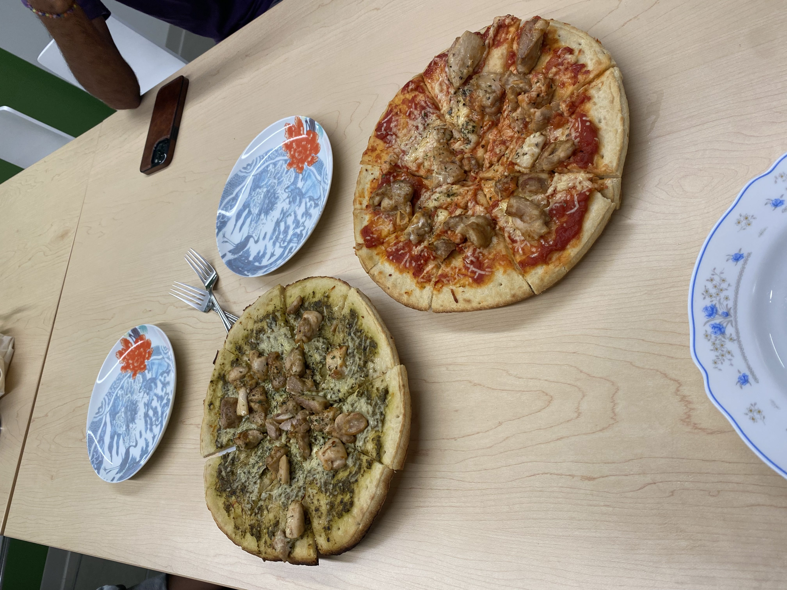
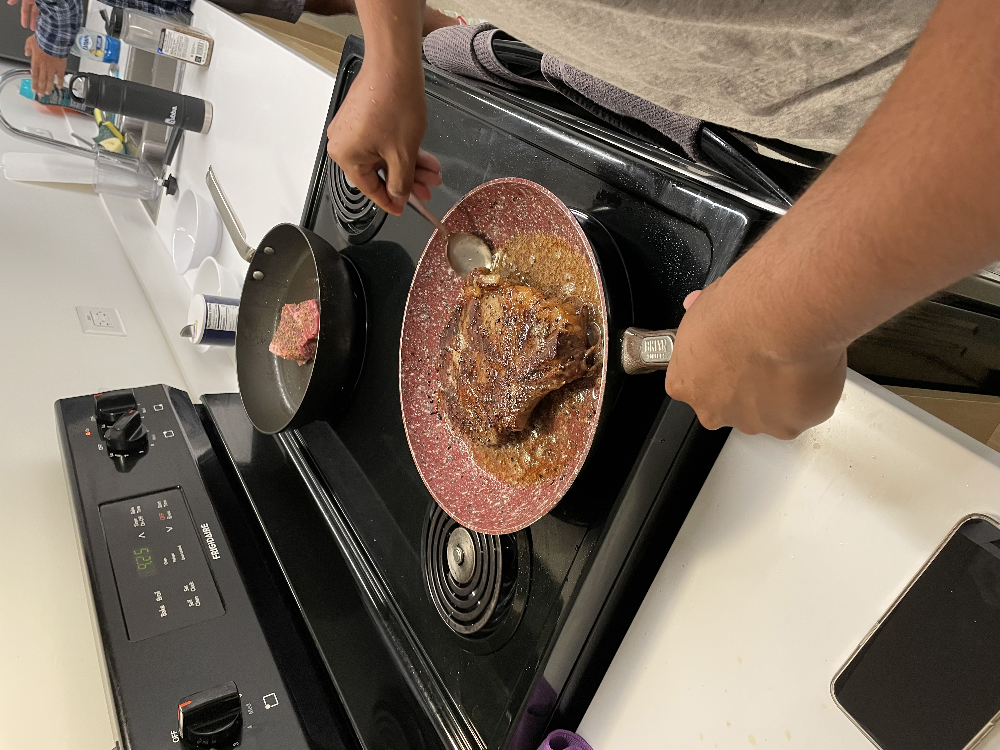

# Introduction
```
print("Hello, I'm Tarun")
```
I'm a **second-year** ~~computer science~~ major at *Sixth College*. My hobbies are 
- Cooking
- Working out
- Hanging out with friends
- Playing videogames

## Cooking Photos
Here are some of the dishes I've made
- 
- 
- 

## Info
You can find my profile and work here:
- Github: [github](https://github.com/tarunm20)
- Linkedin: [linkedin](https://www.linkedin.com/in/tarunmurugan/)

> Thank you for visiting my page!